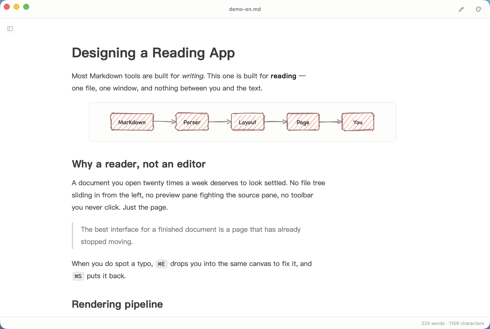
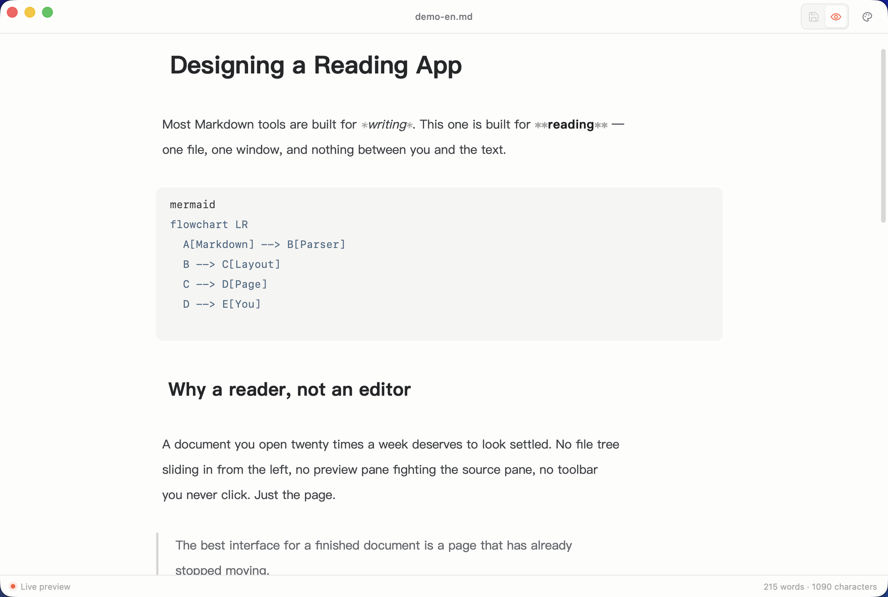
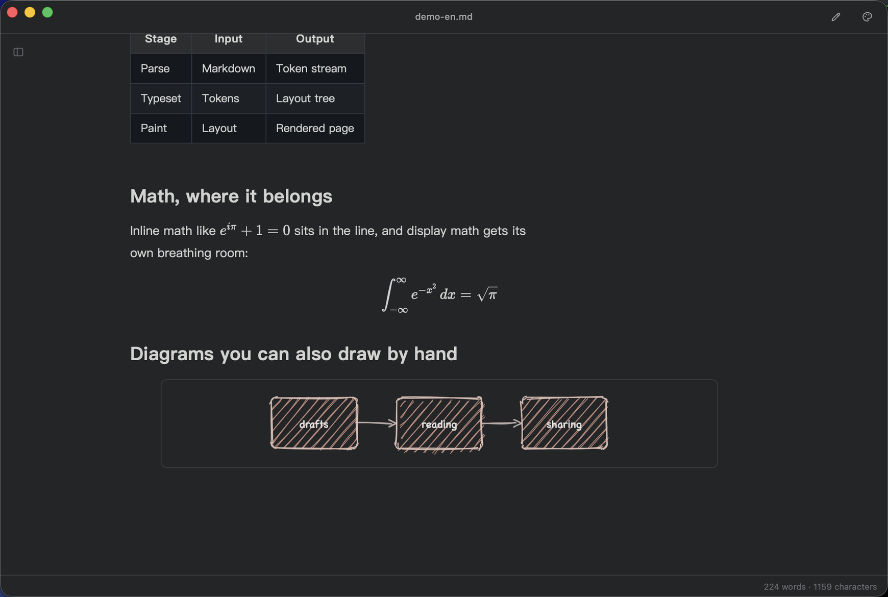
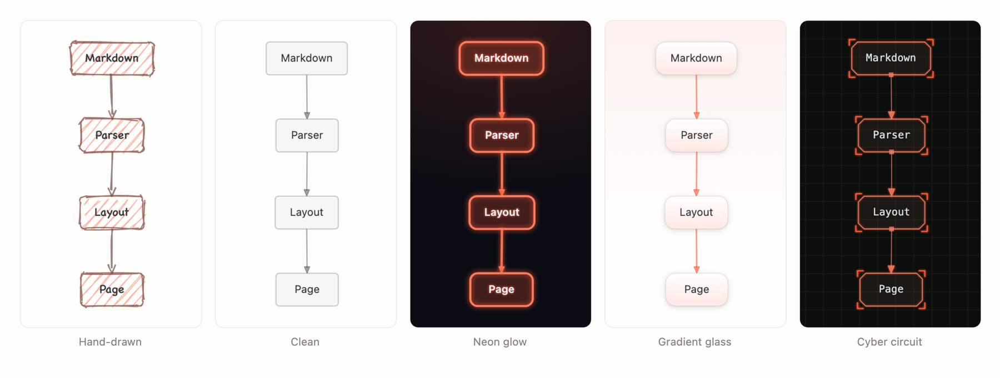

<div align="center">


# 📖 Sū

**A native Markdown reader for macOS** — double-click to read, `⌘E` to edit, renders Mermaid & ASCII.

English · [简体中文](./README.zh-CN.md)

[](./LICENSE)
[](https://tauri.app)

</div>

---

**Sū** (素 — "plain, unadorned") is a desktop app for **reading** Markdown. Double-click a `.md` file and you're straight into the text — no file tree, no crowded panels, no clutter. Just your document, quietly typeset. Spot a typo? Hit `⌘E` to fix it in place.

<p align="center">
  
</p>

## Features

- 📖 **Open and read** — set it as the default app for `.md`; double-click goes straight to the content. One file, one window.
- 📄 **Plain text, properly** — `.txt` goes through the same pipeline, so `#` headings and `-` lists still typeset — while the file's own layout survives: ASCII art and space-aligned tables stay monospaced and intact (the former may even be recognized as a diagram card), and indented paragraphs keep their indentation.
- 🗂️ **Outline sidebar** — a collapsible heading tree; click to jump, and it highlights the section you're reading. Off by default, one tap to open.
- ✏️ **Live typeset editing** — press `⌘E` for a Typora-like single-canvas editor: headings, emphasis, links, quotes, and code render as you type, while Markdown markers reveal themselves on the active line. Press `⌘S` to save in place.
- 🖍️ **Highlighter** — select text in the reader to highlight it in one of four colors; it's written back as `==` / `<mark>` and saved to the file.
- 🧮 **Math** — inline and block formulas via KaTeX, including formulas written across several lines.
- ✨ **Syntax highlighting** — highlight.js, with a one-click copy button on every code block.
- 🔀 **Diagrams, all of them** — Mermaid, flowchart.js `flow` syntax, and hand-drawn ASCII / box-drawing art all render into the same card, drawn in a **hand-sketched style** (wobbly strokes, hachure fill, handwriting labels). Five styles in the toolbar: hand-drawn, clean, neon glow, gradient glass, and cyber circuit — plus a Colorful switch that works with any of them, giving each node its own hue starting from your accent color. Drag nodes to rearrange, zoom and pan, flip to the source, export SVG / PNG, colors follow your theme. Untagged code blocks are auto-detected, so old documents need no edits.
- 🖼️ **Images & zoom** — local images load inline; click to zoom.
- 📊 **Tables** — CJK text doesn't break mid-word; toggle between fit-to-width and horizontal scroll.
- 🌗 **Appearance** — one popover in the title bar holds all three: theme (system / light / dark), four accent colors, and a sans ⇄ serif reading font.
- 📍 **Your place is kept** — switching theme, accent, font, or language, and toggling the outline, all leave you where you were reading instead of snapping to the top; `⌘E` in and out of edit mode lands on the same paragraph.
- 🧼 **Tidy rendering** — YAML frontmatter folds into a compact card; presentational `<font>` tags from rich-text exports (e.g. Yuque) are stripped for clean reading.
- 🌐 **Bilingual (中 / EN)** — the UI follows your system language and switches from the native menu (**View → Language**).
- 🪟 **Out of the way** — custom centered title bar and a word count in the status bar. Closing a window really closes it (you're asked first if there are unsaved changes); closing the last one quits the app.

## A closer look

**`⌘E` — edit in place.** Markdown markers appear on the line the cursor is on; everything else stays typeset.

<p align="center">
  
</p>

**Dark mode**, math, and hand-drawn ASCII, on the same page.

<p align="center">
  
</p>

**Five diagram styles**, one switch in the card toolbar — the same Mermaid / `flow` / ASCII source, drawn five ways.

<p align="center">
  
</p>

## Install

### macOS

Download `Sū_x.x.x_universal.dmg` from [Releases](../../releases) (works on both Intel and Apple Silicon) and drag it into Applications.

> The app isn't notarized by Apple. On first launch, **right-click → Open** to get past Gatekeeper.

### Windows / Linux

Download the matching installer from [Releases](../../releases). File association and opening from the command line are both supported.

## Build from source

Requires [Node.js](https://nodejs.org) and [Rust](https://www.rust-lang.org/tools/install).

```bash
npm install

# Develop (hot reload)
npm run tauri dev

# Build an installer for the current platform
npm run tauri build

# macOS universal binary (Intel + Apple Silicon)
npm run tauri build -- --target universal-apple-darwin
```

## Tech stack

Tauri v2 (Rust backend) + vanilla TypeScript + Vite. Editor: CodeMirror 6. Markdown pipeline: marked + marked-highlight + highlight.js + KaTeX (custom multi-line extension) + DOMPurify + github-markdown-css. Diagrams: a self-contained pipeline — parser → graph model → layered layout → Canvas / SVG renderer — handles ASCII art, `flow` syntax, and Mermaid's flowcharts and state diagrams; the remaining Mermaid types (sequence, gantt, class, …) fall back to the lazy-loaded official library. Rough.js supplies the hand-drawn strokes throughout.

## License

Released under the [MIT](./LICENSE) license. See [THIRD-PARTY.md](./THIRD-PARTY.md) for the full list of third-party assets and dependencies.
