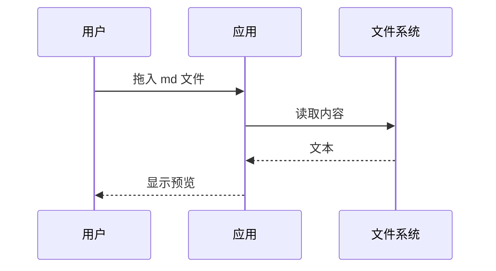
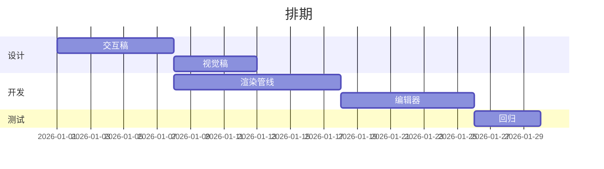
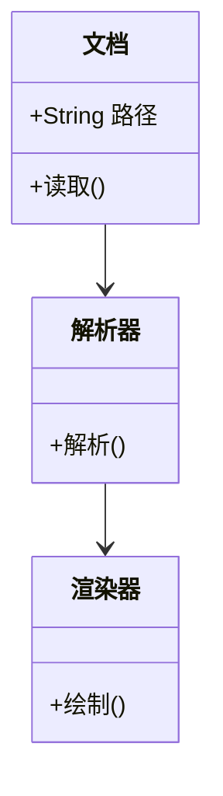
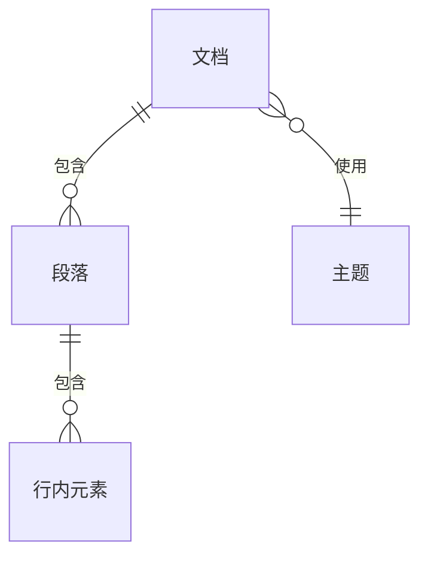
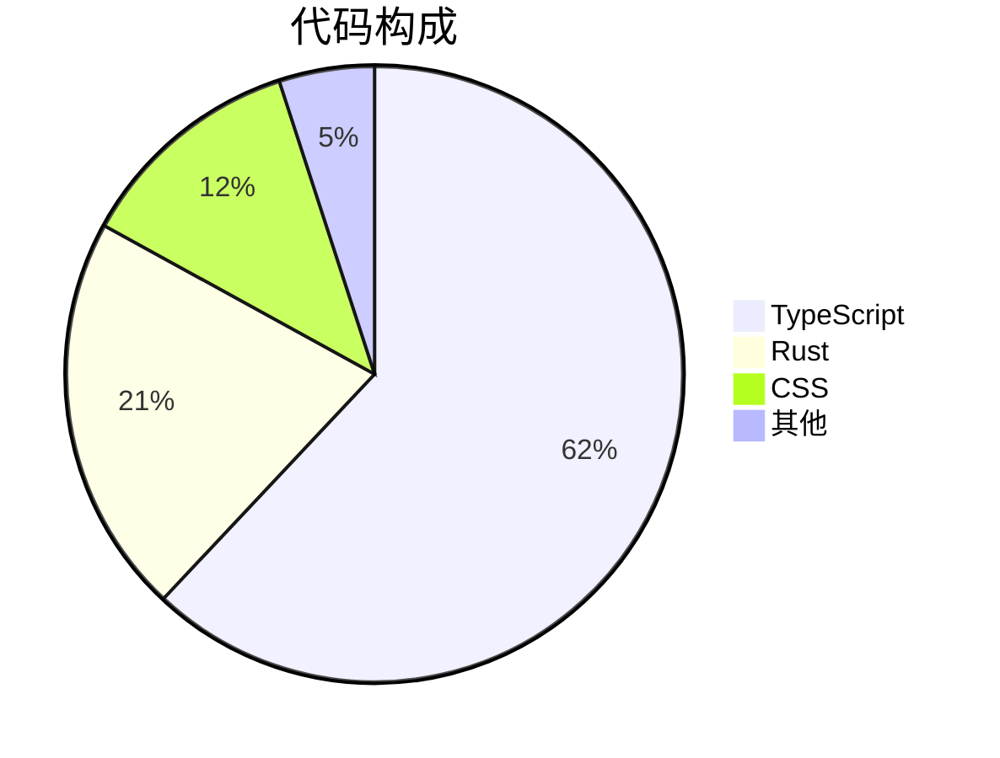
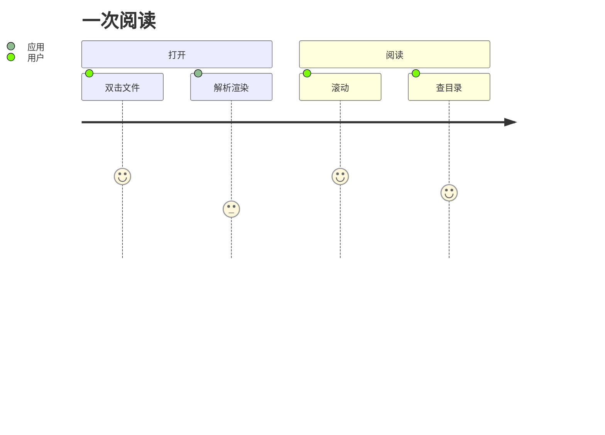
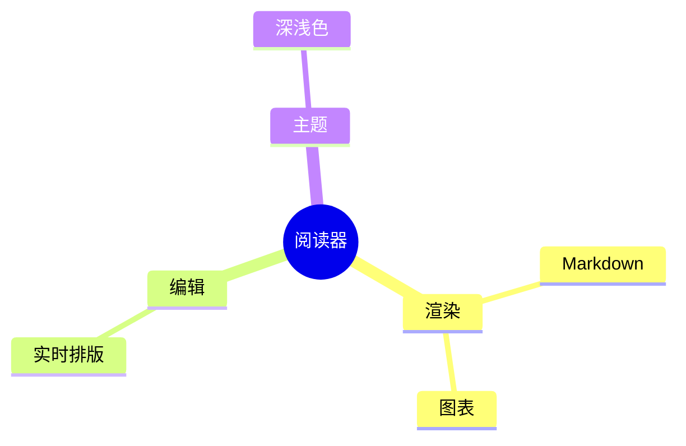

# mermaid 回落图种（临时验收文档）

```mermaid
sequenceDiagram
    participant U as 用户
    participant A as 应用
    participant F as 文件系统
    U->>A: 拖入 md 文件
    A->>F: 读取内容
    F-->>A: 文本
    A-->>U: 显示预览
```

```mermaid
gantt
    title 排期
    dateFormat YYYY-MM-DD
    section 设计
    交互稿      :a1, 2026-01-01, 7d
    视觉稿      :a2, after a1, 5d
    section 开发
    渲染管线    :b1, 2026-01-08, 10d
    编辑器      :b2, after b1, 8d
    section 测试
    回归        :c1, after b2, 4d
```

```mermaid
classDiagram
    class 文档 {
      +String 路径
      +读取()
    }
    class 解析器 {
      +解析()
    }
    class 渲染器 {
      +绘制()
    }
    文档 --> 解析器
    解析器 --> 渲染器
```

```mermaid
erDiagram
    文档 ||--o{ 段落 : 包含
    段落 ||--o{ 行内元素 : 包含
    文档 }o--|| 主题 : 使用
```

```mermaid
pie title 代码构成
    "TypeScript" : 62
    "Rust" : 21
    "CSS" : 12
    "其他" : 5
```

```mermaid
journey
    title 一次阅读
    section 打开
      双击文件: 5: 用户
      解析渲染: 3: 应用
    section 阅读
      滚动: 5: 用户
      查目录: 4: 用户
```

```mermaid
mindmap
  root((阅读器))
    渲染
      Markdown
      图表
    编辑
      实时排版
    主题
      深浅色
```
