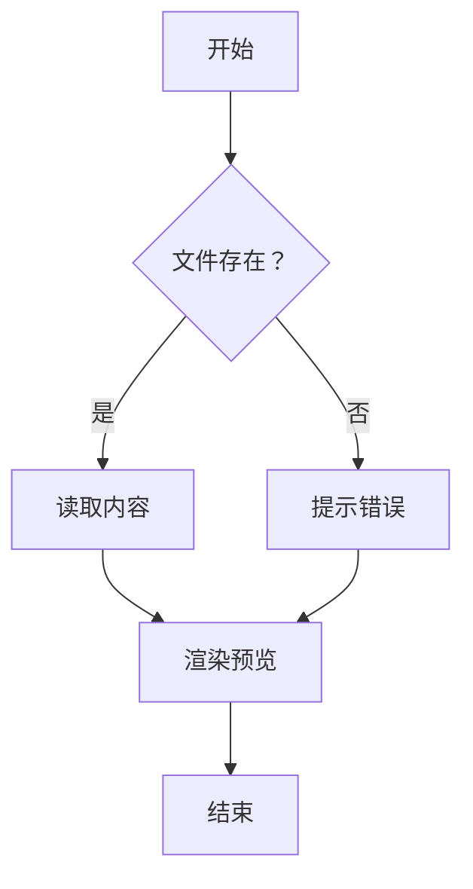
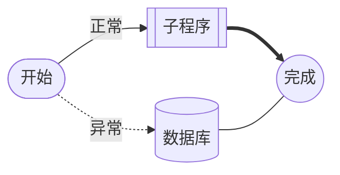
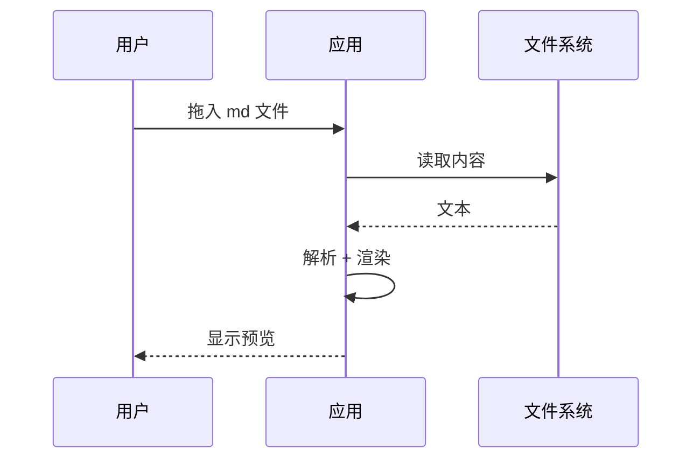
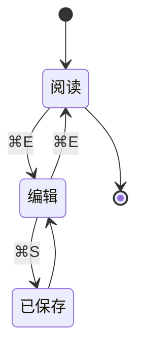

# 流程图适配示例

不管图是用哪种语法写的，渲染出来都是同一种卡片：右上角能缩放、看源码、复制、导出 SVG / PNG，配色跟着深浅色和主题色走。

## 一、Mermaid

````

````


时序图、状态机、甘特图等 mermaid 支持的图种同样适配：

横向布局（`flowchart LR`）与更多形状：



下面这些图种（时序图、甘特图等）仍由 mermaid 官方库渲染，只是套上同一套手绘笔触：





## 二、flowchart.js 的 flow 语法

````
```flow
st=>start: 开始
op=>operation: 读取文件
cond=>condition: 是 Markdown？
io=>inputoutput: 渲染预览
sub=>subroutine: 提示错误
e=>end: 结束

st->op->cond
cond(yes)->io->e
cond(no,right)->sub->op
```
````

```flow
st=>start: 开始
op=>operation: 读取文件
cond=>condition: 是 Markdown？
io=>inputoutput: 渲染预览
sub=>subroutine: 提示错误
e=>end: 结束

st->op->cond
cond(yes)->io->e
cond(no,right)->sub->op
```

## 三、ASCII 手绘图

用 `+ - |` 画的（没有标语言，靠自动识别）：

```
+---------+       +----------+
|  input  | ----> |  parse   |
+---------+       +----------+
                       |
                       v
                  +----------+
                  |  render  |
                  +----------+
```

用制表符画的，带分支和回边：

```
┌──────────┐  yes   ┌──────────┐
│  check   │ ─────> │  apply   │
└──────────┘        └──────────┘
      │                   │
      │ no                │
      v                   │
┌──────────┐              │
│  reject  │ <────────────┘
└──────────┘
```

中文框（宽字符按两列对齐）：

```
+----------+        +----------+
|  源文件  | -----> |  解析器  |
+----------+        +----------+
                         |
                         v
                    +----------+
                    | 渲染输出 |
                    +----------+
```

## 四、不该被当成图的内容

普通代码块照旧是代码块：

```js
function render(markdown) {
  const html = marked.parse(markdown);
  return sanitize(html);
}
```

没识别出结构的字符画，保留原样排版（普通代码块）：

```
  /\_/\
 ( o.o )
  > ^ <
```

即使显式标了 `ascii`，认不出结构时也照原样排版，只是套进图表卡片：

```ascii
  /\_/\
 ( o.o )
  > ^ <
```
